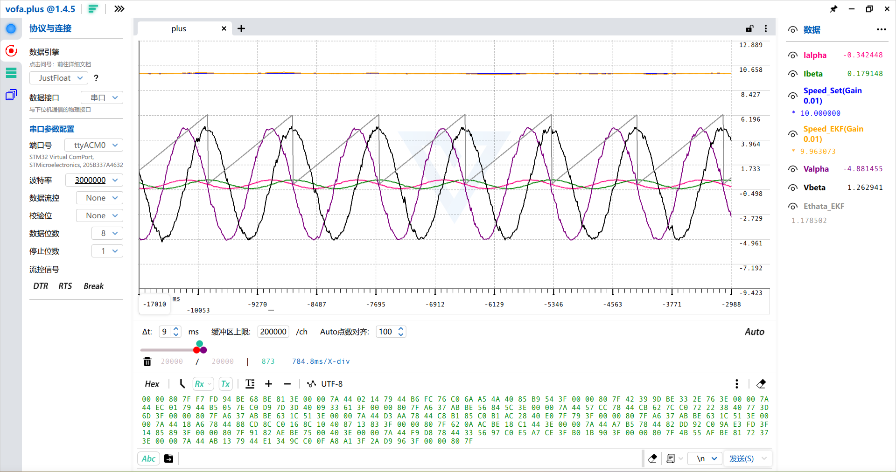

# FOC-Sensorless-EKF-STM32G474

无感FOC项目，采用EKF作为观测器，MCU采用G474，板子使用ST的X-NUCLEO-IHM07M1评估板，项目为Clion的CMAKE项目，可以使用Clion或VSCode打开。

## 🔌 **接线说明**

评估板接12V电源到VIN+和GND，三相输出连接到PMSM上面，G474核心板的PA5、PA6、PA7连接到了评估板的输出使能引脚C7_1、C7_2、C7_3上面。HRTIM的PWM输出PA8、PB12、PB14连接到了评估板的C10_23、C10_21、C10_33。注意评估板没有降压模块，因此3V3不是由评估板提供的，需要由核心板提供，这个电压将用于核心板的电流采样。将核心板的3V3和GND连接到评估板的C7_12、C7_20上面。核心板PA0、PA1为A、B相电流采样，接到评估板C7_28、C7_36上面。

> ⚠️ **注意**：评估板上有VIN+直连的C7_24引脚，请勿把核心板接到该引脚上面，以免大电压损坏你的核心板。在接电前建议再次检查接线是否准确，以免损坏你的器件。

## 🛠️ **快速迁移到你的硬件**

由于考虑到不同的硬件情况，不同PMSM对应的参数也不同，为了让代码能适配其它的硬件情况，请按以下步骤修改对应的代码：

1.PMSM的电阻，电感，磁链不同，请修改PMSM_Control_Core/EKF.c里的void EKF_init()对应的参数

2.直流母线电压不同，请修改PMSM_Control_Core/SVPWM.c里的Udc和DivUdc参数

3.采样电路不同（即不使用配套的评估板而是你自己的板子），请修改PMSM_Control_Core/Hardware.c里的IA_K和IB_K参数，这里的参数表示每安电流对应ADC采样端多少伏的电压，由于上电时，会进行一次VCC_3V3，IA_REF，IB_REF离线校正，因此事实上这三个参数并不需要特意修改

4.在不同的硬件上运行时，如果电机不能运行或者运行一会就停止，请调整一下PI参数，修改PMSM_Control_Core/PI_Controller.h里的GenerateFunction_PIController各项参数

## 📈 **运行以及波形查看**

本代码使用VOFA+作为波形查看器，协议为JustFloat，由于代码中使用USB虚拟串口，所以波特率可以任意设置。在USB_JustFloat.h/.c 里调整singleDataLength和USB_data[USB_DataRecordIndex++]=xxx，可以看到你想要了解的各种运行参数，但是建议singleDataLength不能设置太大，不然发送速率跟不上数据生成的速率，MCU会卡死，电机转不起来。

注意这个评估板电流采样有一两个小的尖峰毛刺，在代码stm32g4xx_it.c的void ADC1_2_IRQHandler(void)使用五点中值滤波去除了，但是会造成波形有一点小的失真，如果你使用的硬件没有这种问题，你可以去除掉中值滤波的过程（或者改用IIR滤波，代码中已经有对应的实现，只是没有用到），以获得更准确的波形和控制效果

## ⚠️ **安全须知**

> 🔥 **本项目涉及电机驱动与功率电路，请务必遵守以下安全规范：**
>
> - **切勿在通电状态下插拔或修改接线**  
> - **首次上电建议使用限流电源（如 12V/2A）并串联保险丝**  
> - **强电（>24V DC 或交流）环境下操作需具备专业电气知识，本项目默认在低压（≤24V）安全电压下运行**  
> - **评估板无隔离保护，核心板与功率地共地，请避免误接高压引脚（如 C7_24）**  
> - **调试时建议远离旋转部件，电机意外启动可能导致人身伤害**
>
> ⚡ **安全第一！任何硬件损坏或人身伤害，作者概不负责。**