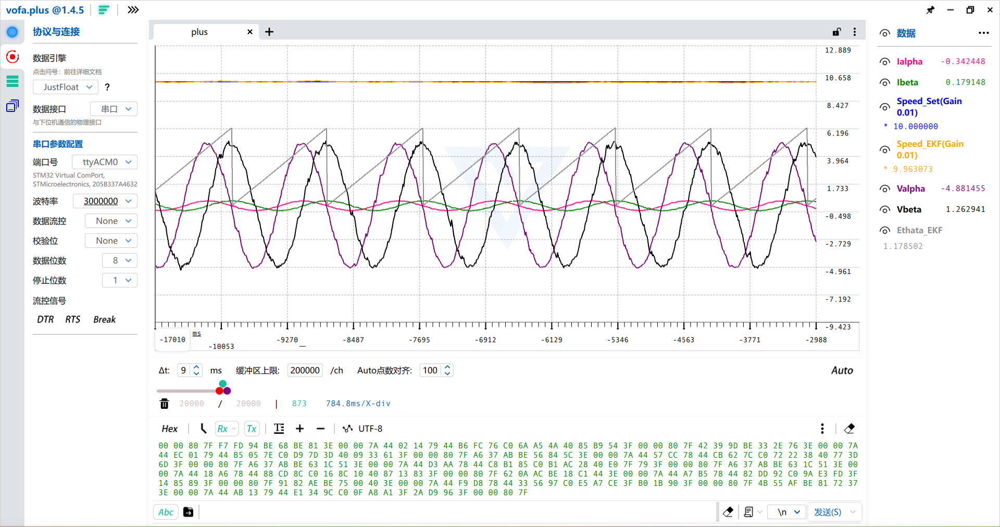
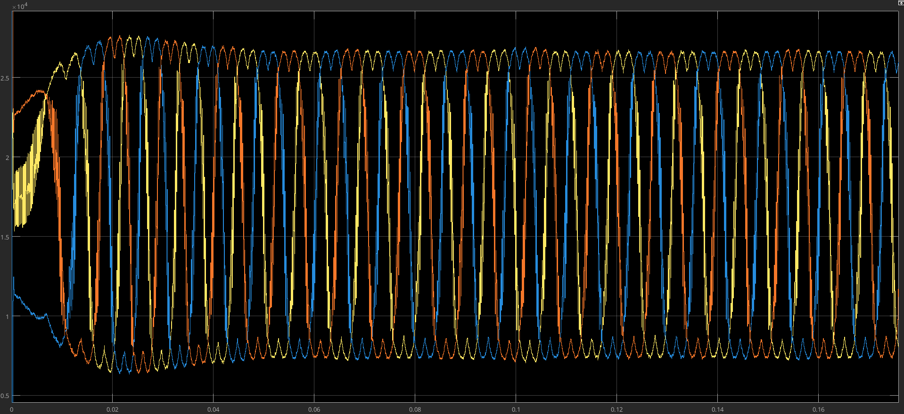
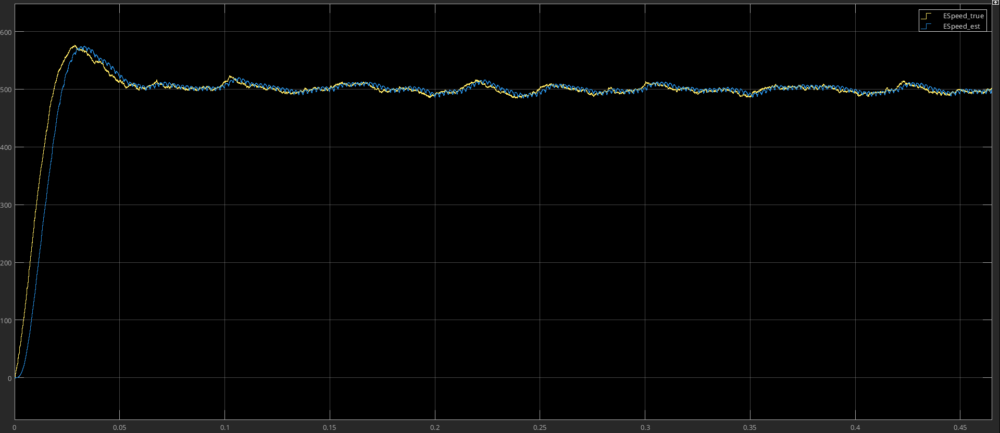
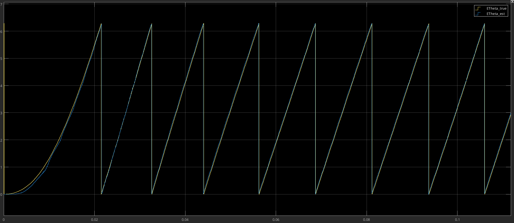
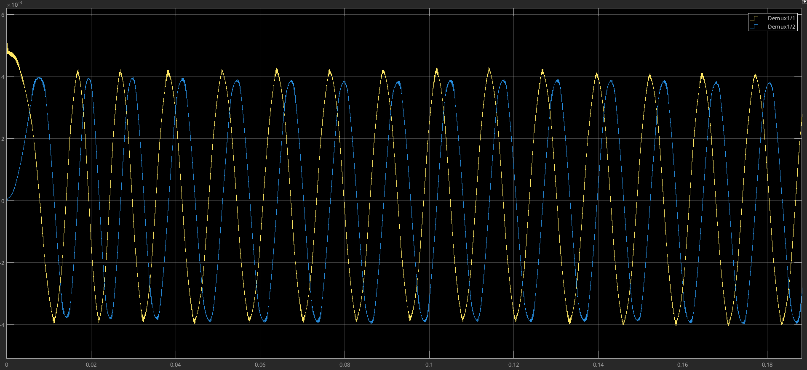
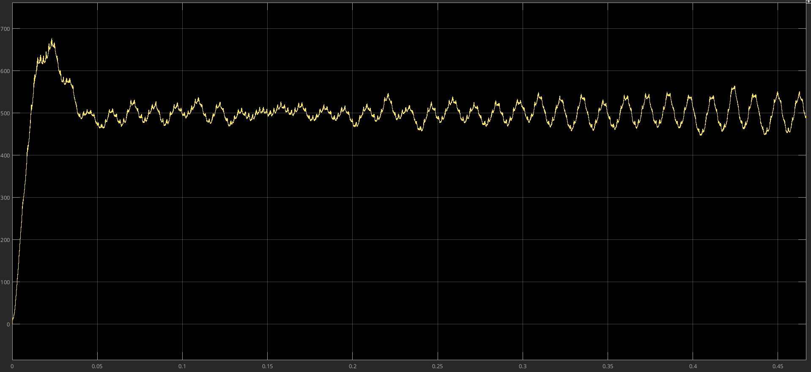
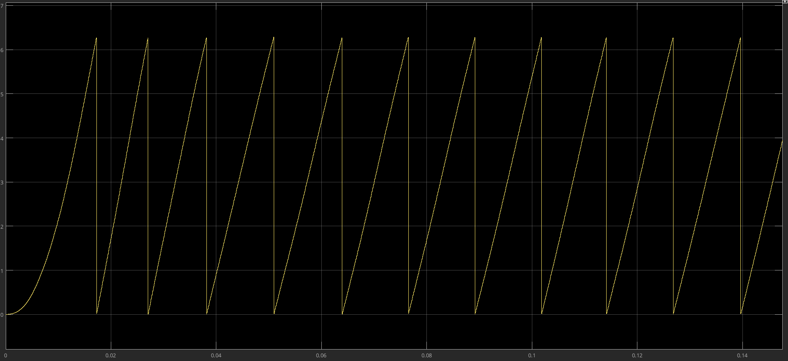
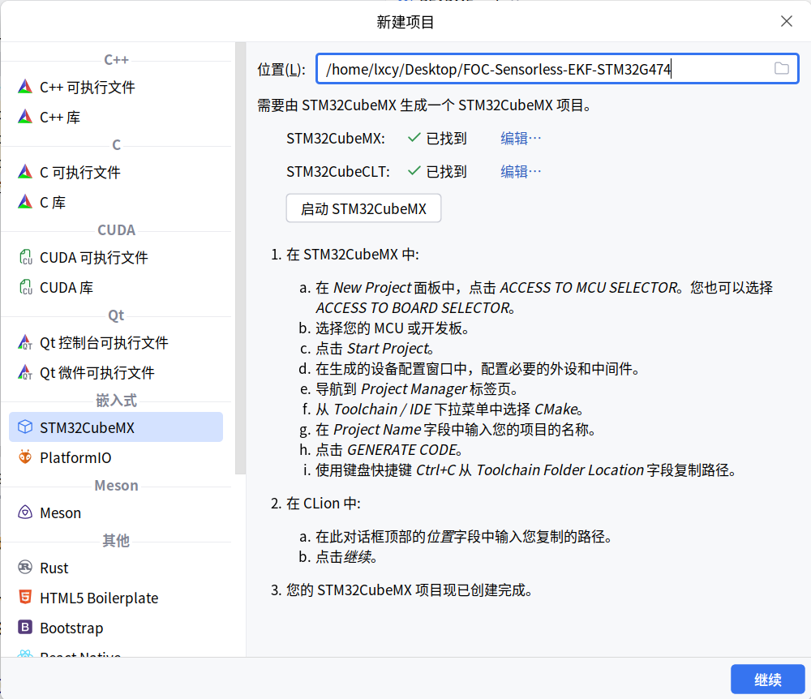

# FOC-Sensorless-EKF-STM32G474

无感FOC项目，采用EKF观测器或非线性磁链观测器(Nonlinear Flux Observer)或滑膜观测器(SMO)，MCU采用STM32G474RET6，板子使用ST的X-NUCLEO-IHM07M1评估板，项目为Clion的CMAKE项目，可以使用Clion或VSCode打开。


## 📋 **总览**

|   参数   |                                                                                                     说明                                                                                                     |
|:------:|:----------------------------------------------------------------------------------------------------------------------------------------------------------------------------------------------------------:|
|  核心板   |                                                                                              STM32G474RET6核心板                                                                                              |
|  驱动板   |                                                                                              X-NUCLEO-IHM07M1                                                                                              |
|  采样电阻  |                                                                                              330mOhm,双电阻采样方案                                                                                               |
| 永磁同步电机 |                                                                          参数为额定电压12V,最大电流1A,Rs=2.75Ohm,Ls=1mH,flux=0.00386335(V·s)                                                                          |
| SVPWM  | 使用HRTIM(STM32G474特有的高精度计时器)产生PWM<br>计时器频率:0.68Ghz(Master Timer) 1.36Ghz(Timer A,B,C)<br>period值:34000(合Master Timer或Timer ABC 0.68Ghz/34000=20khz)<br>PWM模式:中心对称(中间为高电平,两侧为低电平)<br>ADC触发时机:Master Timer更新时 |
|  电流环   |                                                                                              PI控制(有抗饱和),20khz                                                                                              |
|  转速环   |                                                                                      PI控制(有抗饱和),20khz(似乎有些过高,但是无所谓了)                                                                                       |
|  观测器   |                                                                    EKF(20khz)或改进的磁链观测器(20khz)或滑膜观测器(20khz)<br>可在ADC1中断中更改变量Observer的值切换                                                                    | 
|  EKF   |                                                                                      四维状态向量ialpha,ibeta,Espeed,Etheta                                                                                      |
| 磁链观测器  |                                                    我们使用了PLL，并且参考了论文:《Performance Improvement of Nonlinear Flux Observer for Sensorless Control of PMSM》                                                    |
|  SMO   |                                       滑膜观测器不能直接闭环启动(否则有较大概率收敛到反方向最大转速-1800rad/s,其中给定为500rad/s),需要使用IF启动,可以在ADC中断里修改IF启动各项参数<br>SMO的低通滤波需要相位补偿,仿真结果显示仍有小角度误差,等待下一版本修复                                       |
| 与上位机通信 |                                                                                        USB通信，VOFA+(JustFloat协议)显示波形                                                                                        |
|  软件版本  |                                  CLion 2025.3,openocd 0.12.0,arm-gnu-toolchain 15.2,CUBEMX 6.16.0,CUBECLT 1.18.0,MATLAB R2024a,VOFA+ 1.4.5,操作系统版本:deepin V23(Linux 6.18)                                   |


## 🔌 **接线说明**


评估板接12V电源到VIN+和GND，三相输出连接到PMSM上面，G474核心板的PA5、PA6、PA7连接到了评估板的输出使能引脚C7_1、C7_2、C7_3上面。HRTIM的PWM输出PA8、PB12、PB14连接到了评估板的C10_23、C10_21、C10_33。注意评估板没有降压模块，因此3V3不是由评估板提供的，需要由核心板提供，这个电压将用于核心板的电流采样。将核心板的3V3和GND连接到评估板的C7_12、C7_20上面。核心板PA0、PA1为A、B相电流采样，接到评估板C7_28、C7_36上面。

> ⚠️ **注意**：评估板上有VIN+直连的C7_24引脚，请勿把核心板接到该引脚上面，以免大电压损坏你的核心板。在接电前建议再次检查接线是否准确，以免损坏你的器件。

## 🛠️ **快速迁移到你的硬件**

由于考虑到不同的硬件情况，不同PMSM对应的参数也不同，为了让代码能适配其它的硬件情况，请按以下步骤修改对应的代码：

1.PMSM的电阻，电感，磁链不同，请修改PMSM_Control_Core/PMSM_Parameter.h里对应的参数

2.PMSM的极对数不同，请修改PMSM_Control_Core/PMSM_Parameter.h里的POLE_PAIRS参数

3.直流母线电压不同，请修改PMSM_Control_Core/SVPWM.c里的Udc和DivUdc参数

4.采样电路不同（即不使用配套的评估板而是你自己的板子），请修改PMSM_Control_Core/Hardware.c里的IA_K和IB_K参数，这里的参数表示每安电流对应ADC采样端多少伏的电压，此外，上电时，会进行一次VCC_3V3，IA_REF，IB_REF离线校正，因此事实上这三个参数并不需要特意修改

5.在不同的硬件上运行时，如果电机不能运行或者运行一会就停止，请调整一下PI参数，修改PMSM_Control_Core/PI_Controller.h里的GenerateFunction_PIController各项参数，修改PMSM_Control_Core/EKF.c里面的Q，R矩阵(或其它观测器的参数)

## 📈 **运行以及波形查看**



本代码使用VOFA+作为波形查看器，协议为JustFloat，由于代码中使用USB虚拟串口，所以波特率可以任意设置。在USB_JustFloat.h/.c 里调整singleDataLength和USB_data[USB_DataRecordIndex++]=xxx，可以看到你想要了解的各种运行参数，但是建议singleDataLength不能设置太大，不然发送速率跟不上数据生成的速率，MCU会卡死，电机转不起来。

注意这个评估板电流采样有一两个小的尖峰毛刺，在代码stm32g4xx_it.c的void ADC1_2_IRQHandler(void)使用五点中值滤波去除了，但是会造成波形有一点小的失真，如果你使用的硬件没有这种问题，你可以去除掉中值滤波的过程（或者改用IIR滤波，代码中已经有对应的实现，只是没有用到），以获得更准确的波形和控制效果

## 🖥️ **仿真验证**

我们在"Simulink"文件夹里放置了我们的仿真模型，利用该仿真模型，可以快速观察到各变量的变化情况，也可以在无实物的情况下验证算法的可行性，该仿真模型大部分使用S-Function Builder构建，为了验证代码的准确性。以下是一些仿真的结果图片：

SVPWM的比较值(马鞍波):



EKF电转速预测与实际值:



EKF电角度预测与实际值:



磁链观测器的磁链观测值:



PLL输出转速和角度:





## 📎 **补充内容**

·在使用仿真模型时，注意不要将运行模式切换到"加速"或"快速加速"，而是使用"普通"，因为S-Function Builder在"加速"或"快速加速"似乎有些问题，仿真一次后，S-Function Builder里面的变量会维持仿真结束的值，如果再次仿真，建议重新编译一次代码，否则会出现一开始仿真，EKF的预测转速就是几百rad/s的奇怪结果

·工程已升级为CUBEMX6.16.0工程，最新版CUBEMX每次默认生成的代码不含有工具链的说明，直接运行会失败，每次生成代码后，需要在CMakeLists.txt较前部分添加一行：

```cmake
# Include toolchain file
include("cmake/gcc-arm-none-eabi.cmake")
```

·在Documents文件夹里有关于观测器代码推导与实现的简略说明和解释(整个文档的公式由个人整理和推导,可能有错误,不一定和主流方案一致,文档只说明了如何使用理论公式推导出代码,而理论公式如何得到,文档并没有说明,请参考相关的书籍)

·使用CLion打开项目时，不要直接打开CMakeLists.txt或整个文件夹，否则会出现可以编译，但没有下载按钮的情况，可以像新建项目那样打开该项目，如下图所示：

·新增keil项目迁移，现在可以使用keil打开该项目，点击下方链接即可获取:

[访问keil项目](https://github.com/lxcy-tiger/FOC-Sensorless-EKF-STM32G474_keil)



·新增keil项目迁移，现在可以使用keil打开该项目，点击下方链接即可获取:

[访问keil项目](https://github.com/lxcy-tiger/FOC-Sensorless-EKF-STM32G474_keil)

## ⚠️ **安全须知**

> 🔥 **本项目涉及电机驱动与功率电路，请务必遵守以下安全规范：**
>
> - **切勿在通电状态下插拔或修改接线**  
> - **首次上电建议使用限流电源（如 12V/2A）并串联保险丝**  
> - **强电（>12V DC 或交流）环境下操作需具备专业电气知识，本项目默认在低压（≤12V）安全电压下运行**  
> - **评估板无隔离保护，核心板与功率地共地，请避免误接高压引脚（如 C7_24）**  
> - **调试时建议远离旋转部件，电机意外启动可能导致人身伤害**
> - **本代码没有过流保护，如果电机停转可能发热较大，请及时关闭电源，防止电机或板子被烧毁**
> - **本代码暂时未做发送修改速度的功能，上电时即给定500rad/s电角度，因此应注意上电时电机会自动启动**
>
> ⚡ **安全第一！任何硬件损坏或人身伤害，作者概不负责。**